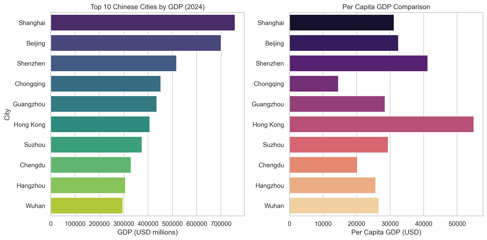

# Top 10 Chinese Cities GDP Report
**Generated on**: 2025-04-06 11:50:22

## Key Findings
1. **GDP Leader**: Shanghai ($757,217 million)
2. **Per Capita Leader**: Hong Kong ($54,950)
3. **GDP Range**: $296,365 - $757,217 million
4. **Per Capita Range**: $14,573 - $54,950

## Visualization

## Raw Data
|   rank | city      | province     |   GDP_2024_CNY |   GDP_2024_USD |   population_millions |   per_capita_gdp_usd |
|-------:|:----------|:-------------|---------------:|---------------:|----------------------:|---------------------:|
|      1 | Shanghai  | municipality |        5392671 |         757217 |                 24.28 |              31186.9 |
|      2 | Beijing   | municipality |        4984310 |         699876 |                 21.54 |              32491.9 |
|      3 | Shenzhen  | Guangdong    |        3680187 |         516757 |                 12.53 |              41241.6 |
|      4 | Chongqing | municipality |        3219315 |         452043 |                 31.02 |              14572.6 |
|      5 | Guangzhou | Guangdong    |        3103250 |         435746 |                 15.31 |              28461.5 |
|      6 | Hong Kong | SAR          |        2899775 |         407176 |                  7.41 |              54949.5 |
|      7 | Suzhou    | Jiangsu      |        2672698 |         375289 |                 12.75 |              29434.4 |
|      8 | Chengdu   | Sichuan      |        2351130 |         330136 |                 16.33 |              20216.5 |
|      9 | Hangzhou  | Zhejiang     |        2186000 |         306949 |                 11.94 |              25707.6 |
|     10 | Wuhan     | Hubei        |        2110623 |         296365 |                 11.12 |              26651.5 |
